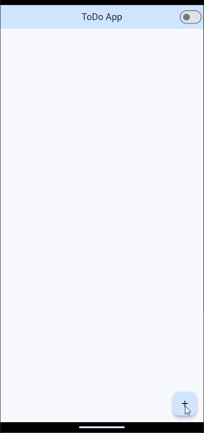
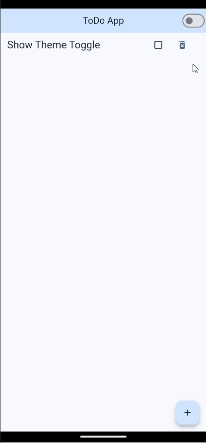

# Flutter ToDo App

A simple **ToDo application** built with **Flutter**.  
This app demonstrates fundamental concepts such as **state management**, **custom widgets**, **lists**, **theming**, **navigation**, and **testing** in Flutter.

---

## 📦 Features in This Release

- Add tasks with a title (first letter automatically capitalized).
- Mark tasks as completed or incomplete.
- Display tasks in a scrollable list.
- Navigate to a Task Detail Screen by tapping on a task.
- Show task status visually (completed/incomplete) in the detail screen.
- Prevent empty or whitespace-only tasks from being added.
- Centralized state management in memory using TaskManager (no database yet).
- Toggle between light and dark mode with smooth transition.
- Unit and widget tests covering task logic, UI interaction, and navigation.

---

## 🎬 App Showcase

Below you can see the main features of the **Flutter ToDo App** in action.

### 🏠 Home Screen — Add and Manage Tasks
Add new tasks, mark them as complete or delete them.  
<br>
<p align="center">
`ADD GIF`
  <!--  -->
</p>

---

### 🌗 Theme Toggle — Light / Dark Mode
Switch seamlessly between light and dark themes.  
<br>
<p align="center">
`ADD GIF`
  <!--  -->
</p>

---

### 🔍 Task Detail Screen
View task details and status visually on a dedicated screen.  
<br>
<p align="center">
`ADD GIF`
  <!--  -->
</p>

---

## 🛠 Tech Stack

- **Flutter** (>=3.0)
- **Dart**
- **Fluttertoast** (for user feedback)
- **flutter_test** (for unit testing and widget testing)

---

## 📁 Project Structure
```
lib/
├─ main.dart  # App entry point and theme management
├─ theme/
│  └─ theme.dart  # Light/Dark theme configurations
├─ screens/
│  ├─ home_screen.dart  # Main ToDo screen
│  ├─ not_found_screen.dart  # Display displayed if expected display does not exist
│  └─ task_detail_screen.dart  # Detail screen for a task
├─ widgets/
   ├─ task_dialog_content.dart #  Custom dynamic Alert Dialog
│  └─ task_tile.dart  # Task item widget with checkbox, delete, and tap actions
├─ models/
│  └─ task.dart  # Task model
├─ managers/
│  └─ task_manager.dart  # Task management logic
└─ utils/
   ├─ input_formatter.dart  # Method to format title task to use Capitalize case
   ├─ input_validator.dart  # Method to valida if the task title is null or empty
   └─ is_task_repeated.dart  # Method to verify if a task is repeated
└─ providers/
   ├─ task_provider.dart  # Methods that manipulate task provider state 
   └─ theme_provider.dart  # Theme state config
└─ router/
   └─ router.dart  # Setting up navigation in the app

test/
├─ providers/
│  ├─ task_provider_test.dart
│  └─ theme_provider_test.dart
├─ screens/
│  ├─ task_detail_screen_test.dart
│  └─ todo_home_screen_test.dart
└─ utils/
   ├─ input_formatter_test.dart
   ├─ input_validator_test.dart
   └─ is_task_repeated_test.dart
└─ widgets/
   └─ task_tile_test.dart
```

---

## 🚀 Installation & Run

Flutter 3+ is required.

1. **Clone the repository:**

```bash
git clone https://github.com/MiltonDJC/flutter-todo-app-riverpod.git

cd flutter-todo-app
```

2. **Get dependencies:**
```bash
flutter pub get
```

3. **Run the app:**
```bash
flutter run
```

Or build an APK for Android:
```bash
flutter build apk --debug
```

<br>

> **Note:** Tasks are stored in memory only; they will reset when the app restarts.

---

## ✅ Testing

Unit and widget tests cover:

- Adding tasks
- Toggling task completion
- Preventing empty or whitespace-only tasks
- TaskTile interactions (add, complete, delete)
- Navigation to **TaskDetailScreen**
- Displaying correct task status in the detail screen

Run tests with:

```bash
flutter test
```

---

## 🧪 Test Coverage

You can generate a **test coverage report** to see which parts of the code are covered by tests.

1. Run tests with coverage:

```bash
flutter test --coverage
```

2. This generates a file ```coverage/lcov.info```.

3. To view a visual HTML report:
```bash
# Install lcov if you don't have it (Linux/macOS)

sudo apt-get install lcov  # or brew install lcov

# Generate HTML report
genhtml coverage/lcov.info -o coverage/html
```

4. Open the report in your browser:
```bash
open coverage/html/index.html  # macOS
xdg-open coverage/html/index.html  # Linux
```
---

## 🧠 Provider vs Riverpod — Comparision

### 💡 Introduction
Both **Provider** and **Riverpod** are libraries for **state management** int Flutter. Provider was the first solution widely adopted by the community, but Riverpod emerges as its modern evolution: **safer, more modular and decoupled from the widget tree**.

In this project, the same application [flutter-todo-app-provider](https://github.com/MiltonDJC/flutter-todo-app-provider.git) was implemented but using ```Riverpod```, with the goal of comparing its architecture, readability and maintainability.

---

## ⚖️ General Comparison

| Aspect | Provider | Riverpod |
|----------|-----------|----------|
| **Flutter Dependency** | Requires `BuildContext` | Not Flutter-dependet (can be used outside the widget tree) |
| **State Reading** | `context.read()` / `context.watch()` | `ref.read()` / `ref.watch()` |
| **Provider Scope** | Limited to the widget tree | Global or local, depending on the need |
| **Hot Reload** | Can lose state | Preserves state after reloads |
| **Testability** | Requires a widget environment (`WidgetTester`) | Testable with `ProviderContainer`, without UI |
| **Performance** | More prone to rebuilds | More controlled and granular rebuilds |
| **Typing and Safety** | More prone to type errors | Safer and compatible with advanced null safety |

---

## 🧩 Practical Example

Below is the same counter implemented with **Provider** and with **Riverpod**, to visualize the syntactic and conceptual differences.

### 🟦 Provider
```dart
final counterProvider = ChangeNotifierProvider((_) => Counter());

class Counter extends ChangeNotifier {
  int value = 0;

  void increment() {
    value++;
    notifyListeners();
  }
}

class CounterScreen extends StatelessWidget {
  const CounterScreen({super.key});

  @override
  Widget build(BuildContext context) {
    final counter = context.watch<Counter>();

    return Scaffold(
      body: Center(child: Text('${counter.value}')),
      floatingActionButton: FloatingActionButton(
        onPressed: counter.increment,
        child: const Icon(Icons.add),
      ),
    );
  }
}
```

### 🟩 Riverpod
```dart
final counterProvider = NotifierProvider<CounterNotifier, int>(CounterNotifier.new);

class CounterNotifier extends Notifier<int> {
  @override
  int build() => 0;

  void increment() => state++;
}

class CounterScreen extends ConsumerWidget {
  const CounterScreen({super.key});

  @override
  Widget build(BuildContext context, WidgetRef ref) {
    final count = ref.watch(counterProvider);

    return Scaffold(
      body: Center(child: Text('$count')),
      floatingActionButton: FloatingActionButton(
        onPressed: () => ref.read(counterProvider.notifier).increment(),
        child: const Icon(Icons.add),
      ),
    );
  }
}
```

---

## 🧭 State Flow
#### Provider
```scss
USER ACTION
   ↓
ChangeNotifier → notifyListeners()
   ↓
ConsumerWidget → complete rebuild
```

#### Riverpod
```perl
USER ACTION
   ↓
Notifier → state++
   ↓
ConsumerWidget (dependents only) → partial rebuild
```

>**Note:** The diagram shows that **Provider** on the **BuildContext**, whereas **Riverpod** uses ```ref``` to access the state, allowing for a cleaner separation between business logic and the interface.

---

## ⚙️ Additional Update
Refactor the Todo App to use code generation for providers via ```build_runner``` and ```riverpod_generator```.
This improves maintainability, reduces boilerplate and aligns with **professional Riverpod practices**.

### 🧠 Implementation
1. 
```yaml
dependencies:
  riverpod_annotation: ^3.0.3

dev_dependencies:
  build_runner:
  riverpod_generator: ^3.0.3
  custom_lint:
  riverpod_lint: ^3.0.3
```
2. Refactores main providers: ```task_provider.dart``` and ```theme_provider.dart``` using the modern ```@riverpod``` annotation:

```dart
import 'package:riverpod_annotation/riverpod_annotation.dart';
part 'task_provider.g.dart';

@riverpod
class TaskNotifier extends _$TaskNotifier {
  @override
  List<Task> build() => const [];

  void addTask(String taskName) { ... }
  void removeTask(Task task) { ... }
  void toggleStatus(Task task) { ... }
  void updateTask(Task task, {String? taskName, bool? status, String? description}) { ... }
}
```
3. Generated ```.g.dart``` files with:
```bash
dart run build_runner watch -d
```

## ✅ Result

The project now leverages **Riverpod 3 with code generation**, maintaining a **clean, scalable and testeable architecture**.

---

### ✅ Conclusion
* **Provider** is ideal for small projects or for learning the basic concepts of reactivity in Flutter.

* **Riverpod**, on the other hand, is a more robust evolution: it eliminates context dependencies, improves performance and facilitates testing and modularity.

* EFor medium or large-scale applications, **Riverpod** is currently the most recommended option by the community.

### 📄 References
* [Official Provider Documentation](https://pub.dev/packages/provider) <br>
* [Official Riverpod Documentation](https://riverpod.dev/docs/introduction/getting_started) <br> 
* [Flutter Docs - State Management](https://docs.flutter.dev/data-and-backend/state-mgmt)
